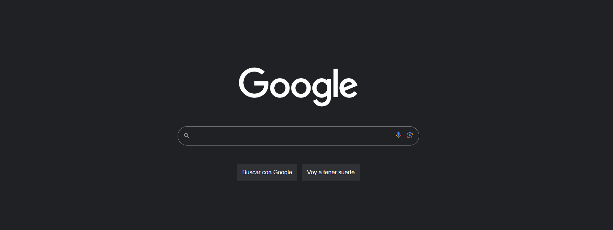
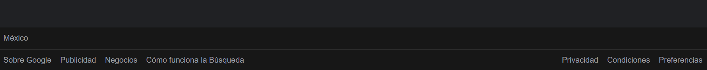

# Clon de Google: Tecnolochicas PRO

Este proyecto fue creado durante el bootacamp Technolochicas PRO, es una página web responsiva (adptable a diversos dispositivos).

El propósito de la creación de este sitio web es el apdrendizaje de HTML Y CSS, de manera que me ayudo a expresar mi creatividad pero sobre todo a adquirir conocimientos nuevos.

Incluye las secciones: cabecera, buscador, pie de página

Incluye recursos multimedia.

<a href="https://clinquant-semolina-416b4c.netlify.app" target="_blank">**Visitalo ahora** 🚀</a>

# Secciones (capturas de pantalla)

Cabecera:

Buscador:

Pie de página:

# Tecnologías

## 📬 Contacto

Si estás interesad@ en compartir o conectar para algún proyecto u oportunidad laboral, contáctame.

<a href=""></img></a>

© 2023 Anyelina Irene Vilchis Sierra (Programa Technolochicas PRO)
